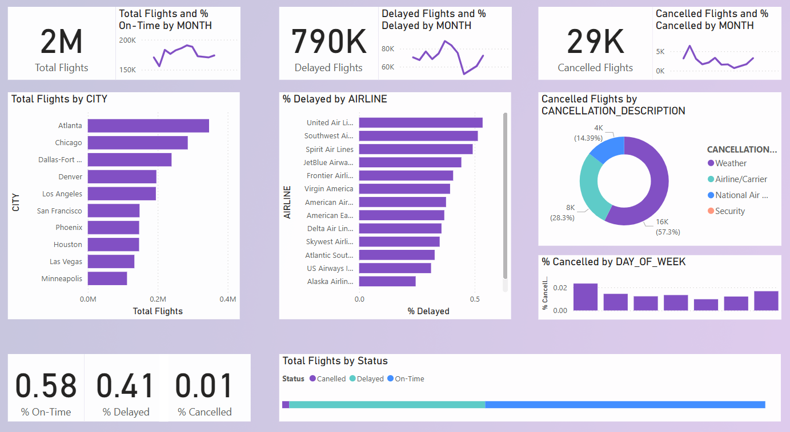

# Flight Data Analysis - Power BI Dashboard  

## Overview  
This Power BI dashboard analyzes flight performance, including:  
✈️ Total flights  
📊 Delayed and canceled flights  
📍 Analysis by city, airline, and month  

## Features  
- Interactive charts and graphs  
- Cancellation reasons breakdown  
- Delay trends over time  

## Screenshots  
  

## How to Use  
1. Download the `.pbix` file  
2. Open in Power BI Desktop  
3. Explore insights and customize  

## Tools Used  
- Power BI  
- DAX (Data Analysis Expressions)
